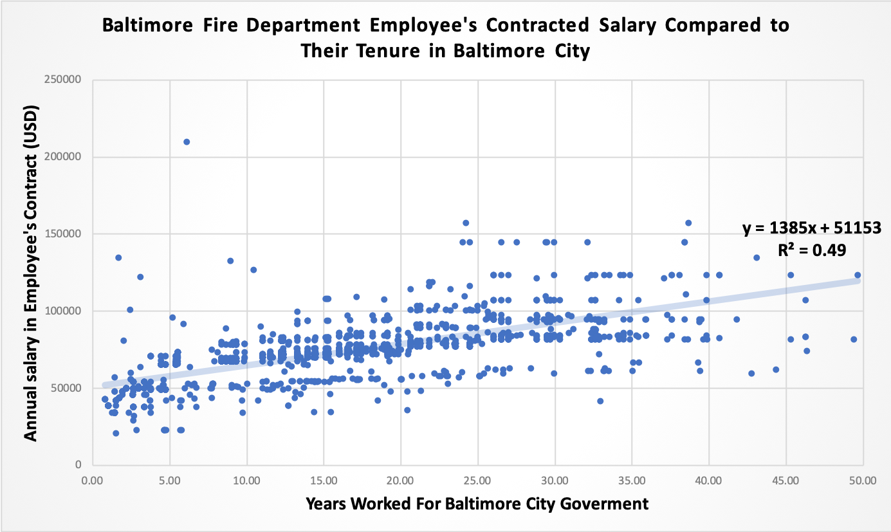

# Baltimore-Fire-Department-Salary-Simple-Linear-Regression-Analysis
## Overview - Background and Findings
In China, probably anywhere in the world, the image of firefighters is often related to altrusim and great. Thus, I want concentrate my analysis towards the income of employees in the fire department with open source data from Open Baltimore which contain all the government employees' income in fiscal year 2019.

The analysis focuses on three aspects:
* What is the linear regression model of employee's contractial income in fire department compares to their tenure.
* What is the linear regression model of employee's actual earning in fire department compared to their tenure.
* What is the linear regression model of employee's difference in earning in fire department compared to their tenure.
#### Insight One
We can see that regarding the question of how the contracted income changes compare to the employment time, the simple linear regression that gives us a result with a R2 value of 49%, which means that this linear model can predict contracted income growth for nearly 50% of employees in the fire department. The standard error of residual is $13684.31, which means that the contracted income for 68% of employees are within $13684.31 from the predicted income.

#### Insight Two
We can see that regarding the question of how the actual earning changes compare to the employment time, the simple linear regression that gives us a result with a R2 value of 49%, which means that this linear model can predict contracted income growth for nearly 50% of employees in the fire department. The standard error of residual is $13684.31, which means that the contracted income for 68% of employees are within $13684.31 from the predicted income.

## Outline of Analysis Process
The original file were exported from the [Open Baltimore Data Base](https://data.baltimorecity.gov/City-Government/Baltimore-City-Employee-Salaries-FY2019/6xv6-e66h), and is available in this repository as a [CSV](Baltimore_City_Employee_Salaries_FY2019.csv) document. The final excel document with the analysis and charts covered is also available in this repository as an [Excel](Baltimore_City_Employee_Salaries_FY2019.xlsx) document.

## Work Cited
Data Source: [Open Baltimore Data Base](https://data.baltimorecity.gov/City-Government/Baltimore-City-Employee-Salaries-FY2019/6xv6-e66h)

## More than You would Want to Know(Step by Step Description of How I Manipulate the Excel)
First we need to take a look at the data and understand the meaning for each label for all non-contract Baltimore City government employees in Fiscal Year 2019:
* NAME: First and last name
* JOBTITLE: Civil service or non-civil service job title in
* DEPTID: Baltimore City government department ID number
* DESCR: Baltimore City government department name and subsection number
* HIRE_DT: Date employee was hired in Baltimore City government
* ANNUAL: Employee’s annual salary as noted in their contract
* GROSS: Employee’s actual earned income from Baltimore City government
Here is a preview of the orignal data from the website
![Alt Text]
## Step 1 - Data Cleaning
### DESCR Column
First, I cleaned the DESCR column to remove the department subcategory numbers so that we can filter departments by name only. I used `Flash Fill Function` in Excel 2016 to auto separate the department names.
To do this, I:
1. Add a column after DESCR and name it as "Department"
2. Manually type in the department for the first row
3. Select all the cells in that column
4. Use short-cut `ctrl + E`

### HIRE_DT Column
We want to analysis factors comparing with the tenure of employees, so we need to have the data of how long they have been employed in Baltimore City. Since there are only the starting date of the employment, I used `Today()` Formula to acheive the goal.

