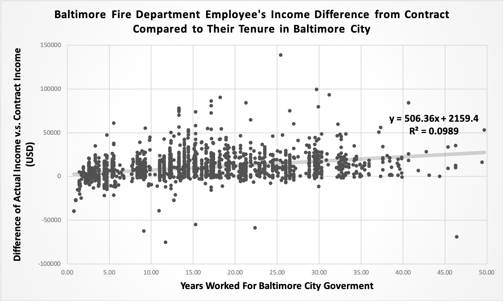
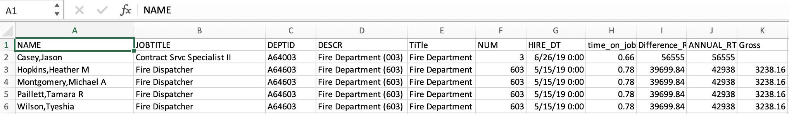

# Baltimore-Fire-Department-Salary-Simple-Linear-Regression-Analysis
## Overview - Background and Findings
In China, probably anywhere in the world, the image of firefighters is often related to altruism and great. Thus, I want to concentrate my analysis on the income of employees in the fire department in Baltimore. Data is open-source data from Open Baltimore, which contains all the government employees' salaries in fiscal year 2019.
The analysis focuses on three aspects:
* What is the linear regression model of employee's contractual income in fire department compares to their tenure.
* What is the linear regression model of employee's actual earning in the fire department compared to their tenure.
* What is the linear regression model of employee's difference in earning in fire department compared to their tenure.
#### Insight One
We can see that regarding the question of how the contracted income changes compare to the employment time, the simple linear regression gives us a result with an R2 value of 49%. It means that this linear model can predict contracted income growth for nearly 50% of employees in the fire department. 

#### Insight Two
We can see that regarding the question of how the actual earning changes compare to the employment time, the simple linear regression gives us a result with an R2 value of 41.36%. It means that this linear model can predict actual earnings growth for about 40% of employees in the fire department. The standard error of residual is $21810.27, which means that the contracted income for 68% of employees are within $21810.27 from the predicted income.

#### Insight Three
We can see that regarding the question of how the difference in earning v.s contracted income changes compare to the employment time, the simple linear regression that gives us a result with an R2 value of 9.89%. It means that this linear model can only predict the difference in earning less than 10% of employees in the fire department. However, the standard error of residual for the linear model is just $14804.61, which means that the income difference for 68% of employees are within $14804.61 from the predicted income. Also, we can conclude that the longer an employee stays in the fire department, he/she would have a higher possibility of earning more than the contracted income.

## Outline of Analysis Process
The original file was exported from the [Open Baltimore Data Base](https://data.baltimorecity.gov/City-Government/Baltimore-City-Employee-Salaries-FY2019/6xv6-e66h) and is available in this repository as a [CSV](Baltimore_City_Employee_Salaries_FY2019.csv) document. The final excel document with the analysis and charts covered is also available in this repository as an [Excel](Baltimore_City_Employee_Salaries_FY2019.xlsx) document.

The research question is: How will the contracted income change in the fire department, and what is the reality? Is the fact matches perfectly with the contract?

Then I manipulated the excel document to create the first two charts presented above:
* [Baltimore_Fire_Department_Employee's_Contracted_Salary_Compared_to_Their_Tenure](Baltimore_Fire_Department_Employee's_Contracted_Salary.png)
* [Baltimore_Fire_Department_Employee's_Annual_Actual_Earning_Compared_to_Their_Tenure](Baltimore_Fire_Department_Employee's_Annual_Actual_Earning.png)

Two models seem to fit because they have the same trend with a similar intercept. However, when I examined it closer, I found that the slope for actual earning is over $500 higher than the contracted income. According to the linear models, if you stayed in the fire department for 30 years, your actual income of that year might be $15190 higher than what is stated in the contract. How Can that be?

So it came to the next question, what is the linear model for the difference between actual earning and contracted income? I create the third chart presented above:
* [Baltimore_Fire_Department_Employee's_Income_Difference_from_Contract_Compared_to_Their_Tenure](Baltimore_Fire_Department_Employee's_Income_Difference_from_Contract.png)

This model help gave some explanations. Although the R2 value is only 9.89%, which means it can only precisely predict 9.89% of the employee, the standard error of residual is much lower than the model for actual earning. Although it can not accurately predict the situation for many people, most people are closely related to the same trend. 

We can see from the third model that the difference between actual earning and contracted income is generally increasing in years. Earning more can be influenced by many factors, such as overtime-earning. However, it's not likely that the longer an employee stays in the fire department, the more overtime he/she would have. Considering the reality, I assume that the increasing difference could be caused by benefits such as compensation for number of years in work, etc.
## Work Cited
Data Source: [Open Baltimore Data Base](https://data.baltimorecity.gov/City-Government/Baltimore-City-Employee-Salaries-FY2019/6xv6-e66h)
## More than You would Want to Know(Step by Step Description of How I Manipulate the Excel)
First, we need to take a look at the data and understand the meaning for each label for all non-contract Baltimore City government employees in Fiscal Year 2019:
* NAME: First and last name
* JOBTITLE: Civil service or non-civil service job title in
* DEPTID: Baltimore City government department ID number
* DESCR: Baltimore City government department name and subsection number
* HIRE_DT: Date employee was hired in Baltimore City government
* ANNUAL: Employee's annual salary as noted in their contract
* GROSS: Employee's actual earned income from Baltimore City government
Here is a preview of the original data from the website

## Step 1 - Data Cleaning
### DESCR Column
First, I cleaned the DESCR column to remove the department subcategory numbers so that we can filter departments by name only. I used `Flash Fill Function` in Excel 2016 to auto separate the department names.
To do this, I:
1. Add a column after DESCR and name it as "Department"
2. Manually type in the department for the first row

3. Select all the cells in that column
4. Use short-cut `ctrl + E`

### HIRE_DT Column
We want to analyze factors comparing with the tenure of employees, so we need to have the data of how long they have been employed in Baltimore City. Since there are only the starting date of the employment, I used `Today()` Formula to achieve the goal.**While the `TODAY()` function counts the days the employee has been employed. I divided it by 365 to get the years of his/her employment**
1. Insert a new column after the HIRE_DT column and name it time_on_job
2. Type in `=TODAY()-` in the first cell and then click on the cell in that row under the HIRE_DT column.
3. Divide the days by 365 to get the years on the job
4. Double click the bottom-right corner of the cell with the formula to fill in all the cells below

### Filtering Data for fire Department (Department Column)
For it to be easier when further creating the linear regression model and analyzing, I filter the data for the fire department. Then copy-paste it into a new worksheet.
1. Select the cell with "Department", click on `Data -> Filter`
2. Use the filter to filter just the information for the fire department
3. Create a new worksheet and copy-paste the information into the new worksheet 

### Simple Linear Regression
Now that I have clean up the data, I can create a linear

